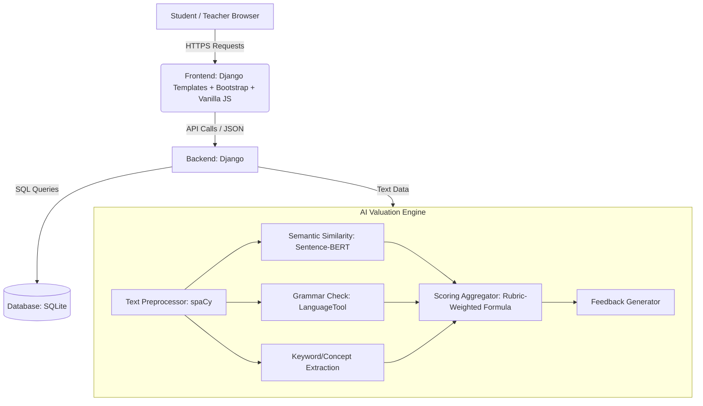

# Implementation Plan: AI-Powered Auto Assignment Valuation System

This document outlines the detailed technical implementation plan for the **Auto Assignment Valuation System**, an AI-powered educational technology platform that automates student essay and short-answer grading using Natural Language Processing (NLP) and Machine Learning (ML).

## Goal Description
The objective is to build a robust, scalable, and highly accurate web-based application that allows teachers to create assignments with model answers and rubrics, automatically evaluates student submissions using semantic similarity (Sentence-BERT/RoBERTa), checks grammar, generates actionable feedback, and offers interactive dashboards for students, teachers, and admins.

---

## User Review Required

> [!IMPORTANT]
> **Key Design Decisions for Romania's Project:**
> 1. **Framework Choice**: Using **Django** for the backend to easily integrate with spaCy and PyTorch/Transformers. The frontend will be powered by **Django Templates** using **Bootstrap** for styling and **Vanilla JS** for client-side interactivity.
> 2. **AI Semantic Model**: We will utilize **Sentence-BERT (`all-MiniLM-L6-v2`)** from Hugging Face's `sentence-transformers` library. It offers state-of-the-art semantic representation with extremely fast inference speeds, which is suitable for standard server environments without massive GPUs.
> 3. **Grammar Checking**: Utilizing **`language-tool-python`** (a wrapper for LanguageTool), which runs locally and is open-source, or **spaCy's custom pipes** for syntax analysis to avoid paying for commercial APIs.
> 4. **Database Selection**: Using **SQLite**, the default database engine in Django, which simplifies setup and deployment for the scope of this project.

---

## Proposed System Architecture



---

## Proposed Changes

### 1. Backend & AI Core (Python)

#### [NEW] Django Project Setup
* Initialize a standard Django project with apps for users, assignments, and AI processing.

#### [NEW] [nlp_engine.py](file:///c:/Users/Romania/Documents/GitHub/Auto-assignment-valuation-system-/ai_core/nlp_engine.py)
* Core NLP pipeline using `spaCy` to clean and preprocess texts (lowercasing, lemmatizing, removing stop words, POS tagging).
* Keyword matching algorithm to ensure critical phrases specified by the teacher exist in the student's answer.

#### [NEW] [semantic_scorer.py](file:///c:/Users/Romania/Documents/GitHub/Auto-assignment-valuation-system-/ai_core/semantic_scorer.py)
* Loads `sentence-transformers/all-MiniLM-L6-v2` or `all-mpnet-base-v2`.
* Calculates cosine similarity between student submission and the model answer.

#### [NEW] [grammar_checker.py](file:///c:/Users/Romania/Documents/GitHub/Auto-assignment-valuation-system-/ai_core/grammar_checker.py)
* Implements `language-tool-python` check to count grammatical errors, spelling mistakes, and return a normalized grammar score (0-100%).
* Pinpoints errors with context to feed into the feedback generator.

#### [NEW] [scoring_aggregator.py](file:///c:/Users/Romania/Documents/GitHub/Auto-assignment-valuation-system-/ai_core/scoring_aggregator.py)
* Applies rubric weightings defined by the teacher.
* Formula: `Final Score = (W_semantic * SemanticScore) + (W_grammar * GrammarScore) + (W_keywords * KeywordScore)`
* Generates structured JSON feedback:
  ```json
  {
    "final_score": 85.5,
    "semantic_score": 90.0,
    "grammar_score": 80.0,
    "keyword_score": 85.0,
    "suggestions": [
      "Excellent coverage of core concepts.",
      "Check subject-verb agreement in sentence 3.",
      "Consider mentioning 'Sustainable Development Goals' to fully address the rubric."
    ]
  }
  ```

---

### 2. Database Schema (SQLite)

We will set up relational tables to manage the auto-grading ecosystem:

#### `users` Table
* `id` (PK), `username`, `email`, `password_hash`, `role` (`student`, `teacher`, `admin`), `created_at`

#### `assignments` Table
* `id` (PK), `title`, `description`, `model_answer` (TEXT), `keywords` (JSON array of strings), `max_points`, `teacher_id` (FK), `created_at`

#### `rubrics` Table
* `id` (PK), `assignment_id` (FK), `semantic_weight` (Float), `grammar_weight` (Float), `keyword_weight` (Float)

#### `submissions` Table
* `id` (PK), `assignment_id` (FK), `student_id` (FK), `submission_text` (TEXT), `submitted_at`

#### `grades` Table
* `id` (PK), `submission_id` (FK), `semantic_score` (Float), `grammar_score` (Float), `keyword_score` (Float), `final_score` (Float), `feedback_json` (TEXT/JSON), `teacher_override_score` (Float), `is_published` (Boolean)

---

### 3. Frontend Dashboards (Vite + React / HTML5 Premium)

#### [NEW] [Teacher Dashboard](file:///c:/Users/Romania/Documents/GitHub/Auto-assignment-valuation-system-/frontend/teacher_dashboard.html)
* **Create Assignment Form**: Inputs for Question, Model Answer, Essential Keywords, and Slider Weights for Rubrics.
* **Grading Panel**: List of submissions, automated AI score, feedback breakdown, and input field for a manual "Teacher Override" score.
* **Learning Analytics**: Visualized distributions of class scores, keyword coverage charts, and most common grammar issues.

#### [NEW] [Student Dashboard](file:///c:/Users/Romania/Documents/GitHub/Auto-assignment-valuation-system-/frontend/student_dashboard.html)
* **Submission Portal**: Plain text editor or drag-and-drop file upload.
* **Feedback Display**: Premium UI showing score dials/gauges, highlighted text showing grammar issues, and a checklist of required concepts/keywords covered.

---

## Verification Plan

### Automated Tests
* Write unit tests in `pytest` to verify the NLP engine:
  - Test semantic matching with identical, paraphrased, and completely off-topic answers.
  - Test grammar parser with grammatically perfect vs. heavily broken text.
  - Test keyword matcher with case-insensitive and partial-word variations.
* Performance benchmarks: Ensure Sentence-BERT embeddings are cached or computed in under 2 seconds per submission.

### Manual Verification
* Upload standard datasets (e.g., Hewlett Foundation Automated Student Assessment Prize - ASAP dataset) to validate correlation between AI-generated grades and human-expert marks (calculating Pearson's $r$ and quadratic weighted kappa).
* Walk through the UI flow: Student submission -> AI Evaluation -> Teacher Override -> Student reviews feedback.
